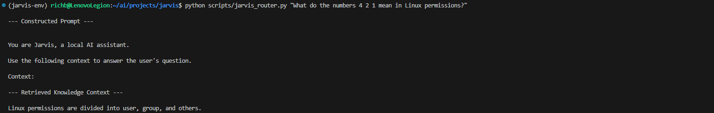
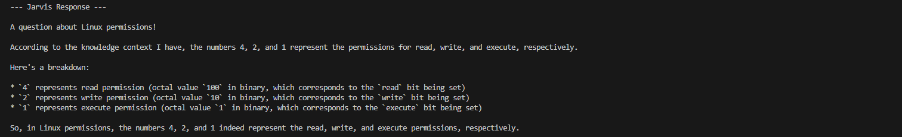
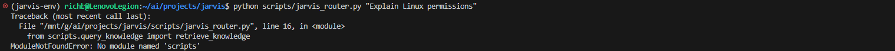
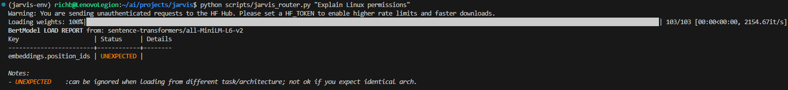

# Build Log 006 – RAG Reasoning Integration

Date: March 2026

## Objective

Upgrade Jarvis from a **semantic retrieval tool** into a **retrieval augmented generation (RAG) assistant** capable of answering questions using locally stored knowledge.

Previous phases established the following capabilities:

- local LLM runtime with Ollama
- browser interface through Open WebUI
- document indexing with LlamaIndex
- semantic search using Chroma
- initial logic routing through `jarvis_router.py`

At the start of this phase, Jarvis could retrieve relevant document chunks from the vector database, but it could not yet pass that context to the local language model for reasoning.

This phase connects the retrieval system to the model so Jarvis can answer questions using its own indexed knowledge.

---

## System State Before This Phase

Previous request flow:

```text
User Question
↓
Jarvis Router
↓
Knowledge Retrieval Tool
↓
Chroma Vector Database
↓
Retrieved Context Printed to Terminal
```

At this stage, the system could locate relevant information, but it did not yet generate answers using that context.

---

## RAG Architecture Introduced

This phase introduced the first complete **retrieval augmented generation** workflow in Jarvis.

New request flow:

```text
User Question
↓
Jarvis Logic Router
↓
retrieve_knowledge()
↓
Chroma Vector Database
↓
Context Assembly
↓
Ollama LLM (llama3.1:8b)
↓
Generated Response
```

The logic router now performs three core actions:

1. retrieve relevant document context from the local vector database
2. assemble a structured prompt containing context and user question
3. send that prompt to the local model for reasoning

This marks the transition from **document retrieval** to **AI-assisted reasoning over local knowledge**.

---

## Scripts Modified in This Phase

Two scripts were modified during this phase.

### Router Script

Script location:

[scripts/jarvis_router.py](../scripts/jarvis_router.py)

The router was expanded beyond simple retrieval orchestration.

New responsibilities added in this phase:

- import the retrieval function directly as a Python module
- assemble a structured prompt for the LLM
- call the Ollama runtime using `subprocess.run()`
- display the generated model response

This changed the router from a tool dispatcher into the first practical **reasoning layer** in the Jarvis system.

---

### Knowledge Retrieval Script

Script location:

[scripts/query_knowledge.py](../scripts/query_knowledge.py)

The retrieval script was refactored from a standalone command-line tool into a reusable Python module.

A new function was introduced:

```python
retrieve_knowledge(question: str, top_k: int = 2) -> str
```

This function now:

- connects to the persistent Chroma database
- loads the `jarvis_knowledge` collection
- performs semantic retrieval
- returns a clean context string for prompt assembly

CLI compatibility was preserved so the script can still be executed directly from the terminal.

---

## Architectural Refactor

Before this phase, the router called the retrieval tool through a subprocess:

```text
Jarvis Router
↓
subprocess call
↓
python scripts/query_knowledge.py
↓
stdout text returned
```

This worked, but it required the router to depend on formatted terminal output from another script.

After refactoring, the architecture became cleaner:

```text
Jarvis Router
↓
retrieve_knowledge()
↓
clean context string returned
```

This improved the design in several ways:

- removed unnecessary subprocess overhead for retrieval
- eliminated dependence on CLI-formatted output
- simplified the logic layer
- made the retrieval system reusable by future tools

This is a more scalable design for the long-term Jarvis orchestration layer.

---

## Prompt Construction

The router now constructs a prompt combining retrieved document context with the user’s question before sending it to the model.

Screenshot:



This prompt acts as the bridge between the knowledge layer and the AI runtime layer.

---

## Verification

Jarvis was tested using the following command:

```bash
python scripts/jarvis_router.py "Explain Linux permissions"
```

During execution, the router:

- retrieved relevant context from Chroma
- assembled a structured prompt
- passed that prompt to `llama3.1:8b`
- received a generated response from the model

This confirms that Jarvis can now perform **retrieval augmented generation** using locally indexed knowledge.

---

## Jarvis Response

After prompt construction, the router passed the context to Ollama and the model generated a reasoning-based response.

Screenshot:



The generated answer did more than simply repeat the retrieved text.

The model reorganized the information into a clearer explanation and expanded on the meaning of Linux permission numbers, confirming that the system is now performing reasoning over retrieved local knowledge.

---

## Retrieval Behavior Observed

The retriever is currently configured with:

```python
similarity_top_k = 2
```

As a result, Jarvis returned two document chunks for the Linux permissions query.

One chunk was directly relevant to Linux permissions.  
A second chunk from the home infrastructure document was also returned because it was semantically similar enough to rank in the top results.

This behavior is expected in early RAG systems and will be improved later through:

- better chunking strategy
- metadata filtering
- relevance tuning
- retriever optimization

---

## Error Encountered During Refactor

During integration, the following import error occurred.

Screenshot:



Cause:

The router attempted to import the retrieval function using:

```python
from scripts.query_knowledge import retrieve_knowledge
```

However, because `jarvis_router.py` resides inside the same `scripts` directory, Python attempted to resolve the path incorrectly when the script was run directly.

Solution:

The import was corrected to:

```python
from query_knowledge import retrieve_knowledge
```

This allows the router to import the retrieval module from the same directory.

---

## HuggingFace Initialization Message

After the retrieval script was converted into an importable module, the following HuggingFace warning and model initialization output became visible during router execution.

Screenshot:



This behavior is expected.

Earlier versions of the system executed retrieval in a subprocess, so model initialization output was less visible in the main router output.

Once retrieval was imported directly into the router, the embedding model initialization occurred within the same Python process and its startup messages appeared in the terminal.

This does not indicate a failure and does not affect system functionality.

---

## Current System State After This Phase

Jarvis can now:

- accept a user question
- retrieve relevant local knowledge
- assemble reasoning prompts
- send those prompts to the local model
- generate answers grounded in indexed documents

This is the first phase in which Jarvis behaves as a true **local AI assistant** rather than only a retrieval tool.

Current stack:

Interface Layer  
↓  
Logic Layer (routing + prompt assembly)  
↓  
Knowledge Layer (Chroma + LlamaIndex retrieval)  
↓  
AI Runtime Layer (Ollama + llama3.1:8b)

---

## Impact of This Phase

This milestone marks one of the most important architectural transitions in the Jarvis project.

Jarvis has now moved from:

```text
semantic search system
```

to:

```text
retrieval augmented AI assistant
```

The system is no longer limited to locating relevant text.  
It can now use that text as context for local model reasoning.

This forms the foundation for future capabilities such as:

- multi-tool orchestration
- internet search integration
- diagnostics tools
- home automation routing
- long-term memory workflows

---

## Next Steps

Future improvements to this subsystem may include:

- suppressing or reducing debug prompt output during normal use
- loading the retriever once at startup instead of rebuilding per query
- improving retrieval relevance through metadata and chunk tuning
- adding additional tools to the logic router
- integrating external search and automation systems

The next phases will continue expanding the Jarvis logic layer into a full orchestration framework.