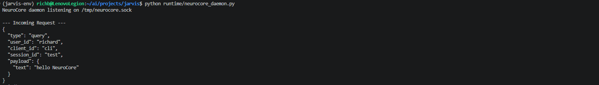
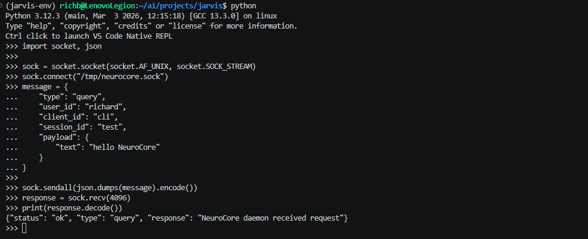

# 009 – NeuroCore Daemon Foundation

## Overview

This milestone introduces the first implementation of the NeuroCore daemon.

Up to this point, NeuroCore operated using a stateless execution model, where each query triggered a new Python process that initialized the entire system, performed a task, and exited.

This approach worked for initial development but introduced several limitations:

- repeated initialization of components  
- slower response times  
- no persistent system state  
- no ability to support continuous interaction  

To address these limitations, we introduced a **persistent daemon architecture**.

The NeuroCore daemon is a continuously running process that serves as the central entry point for all system interactions.

---

## Objectives

The goals of this milestone were:

- establish a persistent background process  
- implement a reliable inter-process communication (IPC) mechanism  
- define a structured request/response protocol  
- validate communication between independent processes  

---

## Architectural Shift

### Previous Model

Each query followed this flow:

user input → Python script → initialize system → process query → exit

This resulted in unnecessary overhead and limited scalability.

---

### New Model

The system now follows:

client → socket → daemon → response → client

This introduces:

- persistent execution  
- reusable system state  
- centralized processing  

The daemon now acts as the **foundation for all future interaction layers**, including CLI, voice interfaces, tablet clients, and event-driven inputs.

---

## Implementation

### Daemon Location

runtime/neurocore_daemon.py

---

### Responsibilities

The daemon is responsible for:

- creating a UNIX socket at `/tmp/neurocore.sock`  
- listening for incoming connections  
- receiving JSON-formatted requests  
- printing incoming requests for visibility and debugging  
- returning structured responses  

---

### Communication Method

I selected a **UNIX domain socket** for IPC because:

- it is fast and local to the system  
- it avoids network overhead  
- it is simple to implement and debug  
- it aligns well with a Linux-based architecture  

---

### Request Format

The request structure was designed to support future system expansion, including multi-user support, multiple client types, and event-driven inputs.

Example:

{
  "type": "query",
  "user_id": "richard",
  "client_id": "cli",
  "session_id": "test",
  "payload": {
    "text": "hello NeuroCore"
  }
}

---

### Response Format

The daemon currently returns a placeholder response:

{
  "status": "ok",
  "type": "query",
  "response": "NeuroCore daemon received request"
}

This confirms communication is working but does not yet invoke the reasoning system.

---

## Testing Procedure

To validate the daemon, a manual client was created using the Python REPL.

### Steps Performed

1. Started the daemon:

   python runtime/neurocore_daemon.py

2. Opened a second terminal and entered Python REPL

3. Established a socket connection to `/tmp/neurocore.sock`

4. Constructed a structured JSON request

5. Sent the request to the daemon

6. Received and printed the response

---

## Results

The test confirmed:

- successful socket connection  
- correct transmission of JSON data  
- daemon correctly received and parsed request  
- daemon returned structured response  
- client successfully received response  

---

## What This Proves

This milestone validates the entire communication pipeline:

client → socket → daemon → response → client

This is the backbone of the NeuroCore system.

All future components will rely on this communication layer, including:

- CLI interface  
- tablet interfaces  
- voice systems  
- event and sensor systems  

---

## Current Limitations

At this stage, the daemon:

- does not yet invoke the router  
- does not load the knowledge system  
- does not maintain conversational context  
- returns a static response  

These limitations are intentional.

The goal of this step was to isolate and validate communication before introducing system complexity.

---

## Significance

This milestone marks a major architectural transition:

from:

stateless script execution

to:

persistent system infrastructure

NeuroCore is no longer just a collection of scripts.

It is now a **running system capable of receiving and processing requests continuously**.

---

## Screenshots

### Incoming Request (Daemon)

---

### Client Response (Python REPL)

---

## Next Steps

The next phase introduces the **Runtime Manager**, which will:

- initialize system components once  
- load the router and knowledge system  
- eliminate repeated initialization  
- connect real query processing to the daemon  

This will transform the daemon from a communication layer into the **active reasoning core of NeuroCore**.