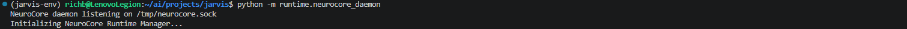
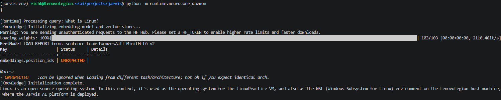
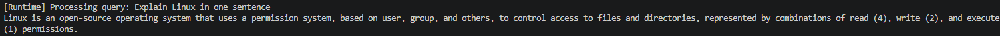

# 010 – Runtime Integration and Persistent Knowledge System

## Overview

This milestone completes the transition of NeuroCore from a collection of scripts into a persistent, stateful AI system.

The system now operates as a continuously running daemon capable of receiving structured requests, processing them through a centralized runtime layer, and returning intelligent responses using a local knowledge base and language model.

This milestone also resolves a critical architectural flaw related to uncontrolled initialization of the knowledge system.

---

## Objectives

- Integrate Runtime Manager into daemon
- Enable real query processing through daemon
- Eliminate stateless execution model
- Prevent repeated initialization of knowledge system
- Establish persistent system behavior
- Validate full end-to-end pipeline

---

## Architectural Evolution

### Previous State

The system previously operated as independent scripts:

user input → script → initialize everything → process → exit

This caused:

- repeated embedding model loads  
- repeated Chroma initialization  
- slow execution  
- no persistent state  
- no centralized control  

---

### New Architecture

The system now operates as:

client → socket → daemon → runtime manager → router → knowledge → LLM → response

Each component has a clearly defined role:

| Component | Responsibility |
|----------|--------|
| Daemon | Communication layer (socket server) |
| Runtime Manager | Persistent system state and request processing |
| Router | Intent handling and prompt construction |
| Knowledge System | Retrieval of relevant context |
| LLM (Ollama) | Response generation |

---

## Runtime Manager Integration

File:

runtime/runtime_manager.py

The Runtime Manager was introduced as the central processing layer between the daemon and the logic system.

Responsibilities:

- accept structured JSON requests  
- validate request type  
- extract user input  
- route queries to logic layer  
- return structured responses  

---

## Import and Execution Issues Encountered

### Issue 1 – Module Import Failures

Error:

ModuleNotFoundError: No module named 'runtime'

Cause:

- Python script executed directly using file path
- Project root not recognized as package context

Fix:

- Converted project into proper Python package using `__init__.py`
- Switched execution method to:

python -m runtime.neurocore_daemon

---

### Issue 2 – Relative Import Failure in Router

Error:

ModuleNotFoundError: No module named 'query_knowledge'

Cause:

- router used local import:
  from query_knowledge import ...

- incompatible with package execution

Fix:

Updated to absolute import:

from scripts.query_knowledge import ...

---

## Critical Architecture Issue – Knowledge System Initialization

### Problem Discovered

During daemon startup, the following occurred:

- embedding model loaded  
- Chroma database initialized  
- retriever created  

This happened BEFORE any query was sent.

Observed behavior:

- daemon startup delayed  
- unnecessary resource usage  
- no control over initialization  

---

### Root Cause

In query_knowledge.py, initialization occurred at import time:

embed_model = HuggingFaceEmbedding(...)
chroma_client = ...
index = ...
retriever = ...

This meant:

import = execute heavy operations

---

### Solution – KnowledgeBase Refactor

The knowledge system was redesigned into a controlled class:

class KnowledgeBase

Key changes:

- removed all global initialization  
- introduced initialize() method  
- added lazy loading  
- ensured initialization occurs only once  

---

### New Behavior

At import:

- no heavy operations

On first query:

- embedding model loads  
- Chroma connects  
- retriever created  

On subsequent queries:

- system reuses existing objects  
- no additional initialization  

---

## Router Refactor

The router was updated to:

- replace retrieve_knowledge() with KnowledgeBase class
- maintain a single persistent instance:

knowledge_base = KnowledgeBase()

- call:

knowledge_base.retrieve(...)

This ensured:

- no repeated initialization  
- compatibility with runtime manager  
- clean separation of logic and state  

---

## Testing Procedure

### 1. Startup Test

Command:

python -m runtime.neurocore_daemon

Observed:

- daemon started instantly  
- no embedding model load  
- no knowledge system initialization  

---

### 2. First Query Test

Query:

"What is Linux?"

Observed:

- runtime processing triggered  
- knowledge system initialized  
- embedding model loaded  
- Chroma connected  
- response generated  

---

### 3. Second Query Test

Query:

"Explain Linux in one sentence"

Observed:

- no knowledge reinitialization  
- no embedding reload  
- response returned in under 3 seconds  

---

## Results

The system now demonstrates:

- persistent daemon execution  
- controlled initialization of heavy components  
- reusable knowledge system  
- significantly improved performance  
- successful end-to-end processing pipeline  

---

## Performance Improvement

| Stage | Behavior |
|------|--------|
| Startup | instant |
| First query | initialization occurs |
| Subsequent queries | fast (< 3 seconds) |

---

## Final System Behavior

Startup:

- immediate readiness  
- no heavy operations  

First query:

- initializes knowledge system  

Subsequent queries:

- use existing system state  
- no reloading  

---

## Significance

This milestone represents a major architectural transition:

from:

stateless scripts

to:

persistent AI system

NeuroCore is now:

- stateful  
- efficient  
- modular  
- extensible  

---

## Screenshots

### Daemon Startup

---

### First Query (Initialization)

---

### Second Query (Fast Path)

---

## Next Steps

- implement CLI interface (`ai` command)
- separate streaming output from returned response
- introduce session memory handling
- begin tool integration layer