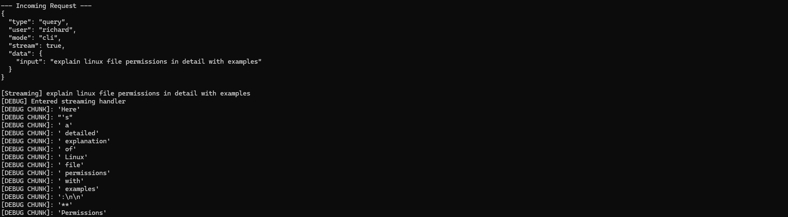
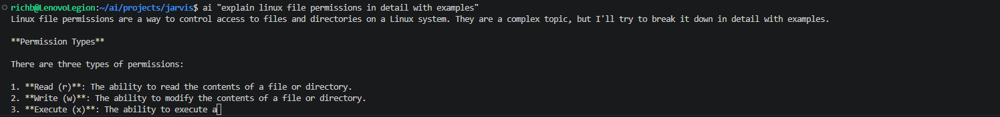

# Build Log 012 – Streaming Pipeline + CLI Behavior

Date: April 2026

## Objective

The CLI interface introduced in the previous phase made the system usable, but it still behaved like a traditional request/response application.

The daemon was already generating output in real time, but the CLI only received the response after everything completed.

The goal for this phase was to implement true streaming across the entire system so output appears in the CLI as it is generated.

Target behavior:

    ai "explain linux permissions"

With output appearing progressively instead of all at once.

---

## System State Before This Phase

Current flow:

    CLI → daemon → runtime → router → model → full response → CLI

Limitations:

- CLI waited for full response  
- no real-time feedback  
- streaming only visible inside daemon terminal  
- router printed output instead of returning it  

The system worked, but did not feel interactive.

---

## Streaming Design

Streaming needed to start at the model and move through every layer of the system.

Target pipeline:

    Ollama (stream)
    ↓
    Router (generator)
    ↓
    Daemon (forward chunks)
    ↓
    CLI (print in real time)

---

## Issue 1 – Streaming Was Trapped in Router

The router was already using streaming:

    for line in response.iter_lines():
        print(chunk)

This created the illusion of streaming, but only inside the daemon terminal.

The runtime and CLI never received any of that data.

### Fix

Refactored the router to return data instead of printing it.

- introduced generator-based streaming  
- removed all print statements  
- added:

    query_ollama_stream()
    run_query_stream()

Now the router acts as a proper data source.

---

## Issue 2 – No Output in CLI

After wiring streaming through the daemon, the CLI produced no output.

The daemon showed that streaming was being triggered, but no data was reaching the client.

### Root Cause

The streaming generator was not yielding any chunks.

Ollama responses were being received, but not parsed correctly.

---

## Issue 3 – Ollama Streaming Format

Ollama returns JSON lines:

    {"response": "Linux", "done": false}
    {"response": " is", "done": false}
    {"done": true}

The implementation failed to:

- filter empty chunks  
- properly extract response text  
- stop when complete  

### Fix

Updated streaming parser to:

- decode JSON safely  
- extract only non-empty "response" values  
- stop when "done": true  

---

## Streaming Verified

After fixing parsing, chunks appeared in daemon output.

### Screenshot

Example:

    [DEBUG CHUNK]: 'Linux'
    [DEBUG CHUNK]: ' is'
    [DEBUG CHUNK]: ' a'

This confirmed streaming was working at the router and daemon layers.

---

## CLI Streaming Behavior

Running:

    ai "what is linux"

Now produces immediate output.

### Screenshot

Longer responses visibly stream in real time.

---

## Issue 4 – CLI Command Override

While testing interactive mode, the CLI behaved incorrectly.

Typing:

    exit

returned a model response instead of exiting.

### Root Cause

The `ai` command was overridden by a shell function:

    ai() { ollama run ... }

### Fix

Removed override:

    unset ai

Verified correct command:

    type ai

Now points to:

    /usr/local/bin/ai

---

## Issue 5 – CTRL+D Exit Behavior

CTRL + D produced:

    CLI Error:

### Root Cause

EOF was not handled explicitly.

### Fix

Added EOFError handling in CLI loop.

---

## Final System Behavior

### One-shot

    ai "query"

- immediate execution  
- streaming output  

---

### Interactive

    ai
    > query
    > query
    > exit

- persistent session  
- real-time output  
- clean exit  

---

### Cold Start

- initializes embeddings + vector DB  
- slower first query  

---

### Warm State

- no reinitialization  
- fast streaming responses  

---

## Updated Architecture

    CLI (streaming)
    ↓
    UNIX Socket (/tmp/neurocore.sock)
    ↓
    NeuroCore Daemon (chunk forwarding)
    ↓
    Runtime Manager
    ↓
    Router (generator-based streaming)
    ↓
    Knowledge System
    ↓
    Ollama

---

## Outcome

NeuroCore now behaves as a real-time system.

The CLI no longer waits for full responses.

Streaming is implemented across the entire pipeline.

---

## Next Step

STDIN ingestion:

    df -h | ai
    cat logs.txt | ai

---

## Summary

This phase completed the transition from:

    buffered request/response system

to:

    real-time streaming AI pipeline

The system now feels responsive and usable from the command line.