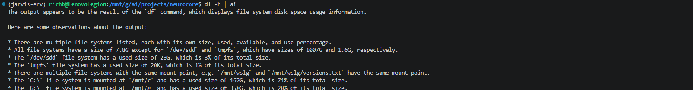
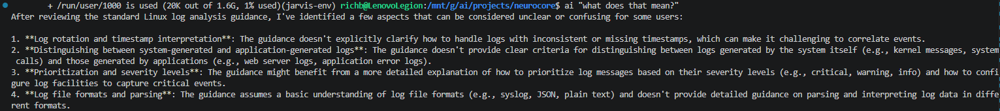
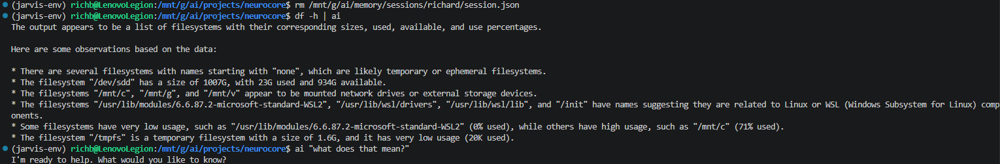
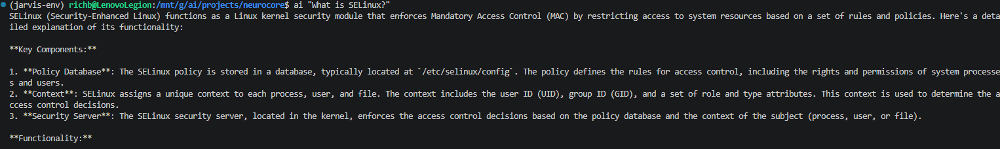

# 016 – Runtime Control Plane Enforcement

---

## Overview

This phase is where NeuroCore stopped behaving like a loose AI wrapper and started acting like a controlled system.

Up to this point, responses were generally correct, but behavior was inconsistent depending on what had been asked previously. That made it clear the model still had too much control over context and interpretation.

The goal of this phase was to fix that by enforcing a real control plane.

---

## The Problem

I started noticing inconsistent behavior when running the same commands in slightly different sequences.

Example:

```bash
df -h | ai
ai "what does that mean?"
```

Sometimes it would correctly interpret disk usage. Other times it would jump to completely unrelated topics like SELinux logging.

That immediately told me:

> The system was not actually controlling context — the model was.

---

## Initial Behavior

### Pipe Input Test

```bash
df -h | ai
```



This part was mostly working. The system correctly treated piped input as data and did not attempt execution.

---

## Failure Case – Ambiguous Queries

```bash
ai "what does that mean?"
```



Instead of asking for clarification, it would:

- pull unrelated context
- hallucinate technical explanations
- latch onto previous topics (especially SELinux)

At this point it became clear:

> There was no control over ambiguous queries.

---

## Troubleshooting Process

### Attempt 1 – Router-Level Fix

I added ambiguity detection inside the router.

Result:
- Did not consistently trigger
- Model still produced unrelated answers

Conclusion:
> Detection was happening too late in the pipeline.

---

### Attempt 2 – Improved Matching Logic

I relaxed the matching rules:

- exact match → partial match
- phrase detection → keyword detection

Result:
- Still inconsistent

Conclusion:
> Input was being altered before detection.

---

### Root Cause Identified

The key issue ended up being:

> Input was being rewritten or influenced by context BEFORE ambiguity detection.

So even though I was checking for ambiguous queries, I was no longer checking the *original* user input.

---

## Final Fix

The fix was not improving the model.

The fix was:

> Move control OUT of the model and INTO the system.

Ambiguity detection was moved to the earliest possible point:

### Runtime Manager

- Evaluate raw input before any processing
- Block ambiguous queries immediately
- Return a deterministic response

---

## Clean Validation (Final Test)

To make sure nothing from previous testing was affecting behavior, I cleared session memory and ran a full validation sequence:

```bash
rm /mnt/g/ai/memory/sessions/richard/session.json
df -h | ai
ai "what does that mean?"
```



Results:

- Pipe input treated as data
- No execution behavior
- No hallucinated context
- Ambiguous query handled safely

---

## Normal Query Validation

```bash
ai "What is SELinux?"
```



This confirmed:

- Normal queries still work correctly
- System is not over-restricting valid input

---

## Key Implementation Areas

- Runtime control enforcement  
  → `runtime/runtime_manager.py`

- Routing and response handling  
  → `scripts/jarvis_router.py`

---

## What Changed

Before:

- Model decided meaning
- Context leaked between queries
- Ambiguous queries produced fabricated answers

After:

- System decides what is valid
- Context is controlled
- Ambiguous queries are blocked or clarified

---

## What This Phase Achieved

- Control plane enforcement
- Execution prevention
- Pipe input isolation
- Memory containment
- Ambiguity handling

---

## What Is Still Missing

Not part of this phase:

- Tool execution layer
- Session lifecycle management
- Long-term memory
- Observability/logging

---

## Final Thoughts

This phase was less about adding features and more about taking control away from the model.

Once that was done, everything became predictable.

That’s what makes the next phase possible.

---

## Next Phase

Phase 5B – Tool Execution Layer