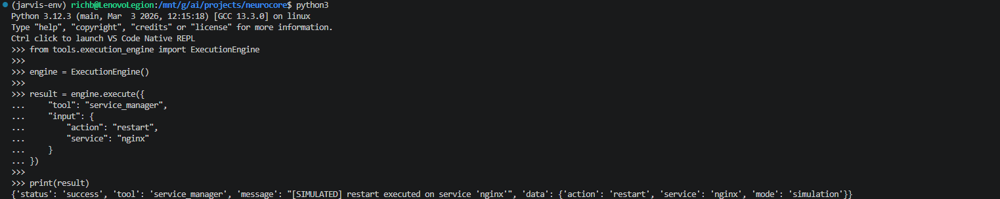
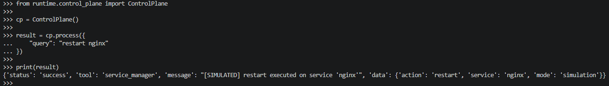
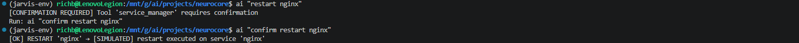
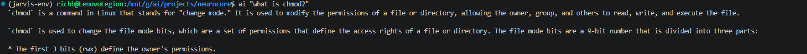

# 017_execution_layer_and_control_integration.md

## Overview

This phase introduces the **Tool Execution Layer** and integrates it into the NeuroCore runtime.

NeuroCore transitions from a system that could only **analyze and advise** into a system that can now **execute controlled actions**, while still maintaining strict safety and architectural boundaries.

---

## Problem

Before this phase:

- Execution intent was detected but always blocked
- All action-based requests were downgraded to advisory responses
- There was no structured execution system
- No standardized tool interface existed
- No enforcement existed between:
  - intent detection
  - execution authorization
  - execution safety

This meant NeuroCore could explain how to perform actions, but could not safely perform them.

---

## Goals

- Introduce a structured **execution layer**
- Maintain **control plane authority**
- Prevent unsafe or implicit execution
- Build a scalable **tool architecture**
- Preserve the existing reasoning pipeline
- Introduce a safe execution model with explicit user confirmation

---

## Implementation

### Tool Execution Layer

A new `tools/` package was introduced:

- `base_tool.py`
  - Defines a strict tool contract
  - Enforces validation and structured output

- `tool_registry.py`
  - Central registry of all available tools
  - Prevents execution of unregistered tools

- `execution_engine.py`
  - Single controlled entry point for execution
  - Handles validation, execution, and error normalization

---

### First Tool — Service Manager

Implemented:

```
tools/system/service_manager.py
```

Capabilities:

- start / stop / restart / status (simulated)

Design decisions:

- Strict input validation
- Structured output format
- No direct system execution (safe simulation only)

---

### Execution Engine Validation

Initial validation was performed directly against the execution engine.

This confirmed that:

- tools can be executed independently
- structured inputs are enforced
- structured outputs are returned



---

### Control Plane Integration

The control plane was extended to:

- detect execution intent
- translate natural language into structured tool requests
- route execution into the execution engine

This establishes the control plane as the **single authority** over execution.



---

### Runtime Integration

The runtime manager was updated to:

- route execution requests through the control plane
- preserve the reasoning pipeline
- maintain ambiguity detection and blocking

Execution and reasoning are now cleanly separated paths.

---

### Response Formatting Layer

A formatting layer was introduced at the runtime boundary to:

- convert structured execution results into human-readable output
- preserve structured backend data
- maintain separation between logic and presentation

---

### Execution Safety Model

A confirmation-based safety model was implemented.

Execution modes:

- `auto` → execute immediately
- `manual` → require explicit confirmation
- `dry-run` → execution blocked

Behavior:

```
ai "restart nginx"
→ confirmation required

ai "confirm restart nginx"
→ execution allowed
```

This model is:

- stateless
- deterministic
- resistant to ambiguity
- fully enforced by the control plane

---

### Execution Flow Validation

The full execution flow was validated through the CLI.

This demonstrates:

- execution is blocked by default
- explicit confirmation is required
- execution is only performed after confirmation



---

### Reasoning Path Validation

The reasoning pipeline was tested to ensure it remained unaffected.

This confirms:

- RAG and LLM behavior is preserved
- execution changes did not interfere with reasoning



---

## Validation Summary

### Execution Path

```
ai "restart nginx"
→ blocked

ai "confirm restart nginx"
→ executed (simulated)
```

### Reasoning Path

```
ai "what is chmod?"
→ RAG + LLM response
```

### Observations

- Execution path is fast and deterministic
- Reasoning path remains intact
- Lazy loading behavior confirmed
- No unintended execution paths observed

---

## Architecture Outcome

NeuroCore now supports:

- Structured execution pipeline
- Tool-based architecture
- Control plane governed execution
- Explicit confirmation safety model
- Clean separation between reasoning and execution

---

## Key Insight

This phase establishes NeuroCore as:

> A **controlled execution system**, not just an AI assistant.

---

## Next Phase

Future work will include:

- policy expansion
- execution logging / observability
- real system command execution
- task persistence
- session-aware confirmation model