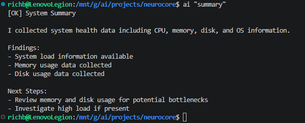
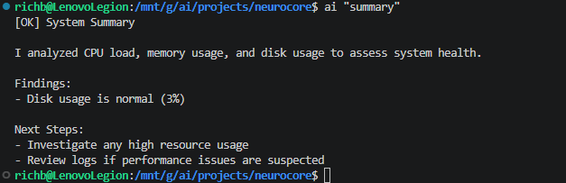
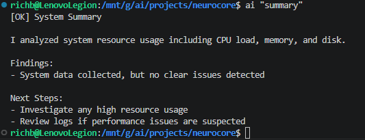
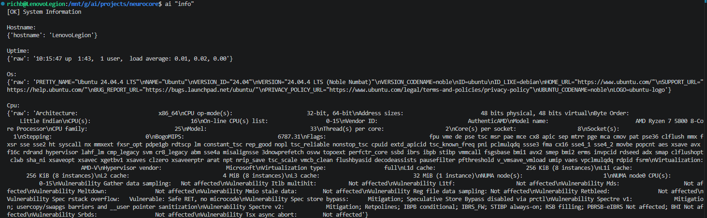
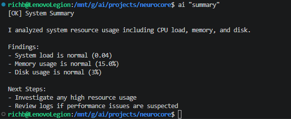
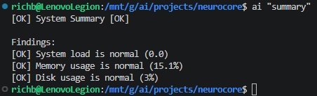
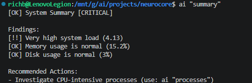
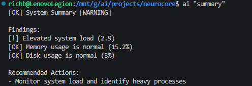
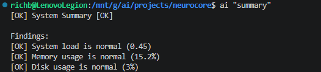

# 021 – Argus Tool Layer Initial Implementation

---

## Objective

This phase introduces the Argus tool layer on top of NeuroCore.

The goal here was to establish a repeatable pattern for:

- consuming structured system data  
- interpreting real system signals  
- producing clear, actionable output  
- staying fully aligned with the existing execution pipeline  

This is the point where NeuroCore moves from simply executing commands to actually *understanding* system state.

---

## Starting State

Going into this phase:

- system tools were fully built and working  
- execution flow through the control plane was stable  
- CLI (`ai`) was functional  
- all system tools returned human-readable output  
- no structured data existed  
- Argus did not exist yet  

Relevant locations:

- `/mnt/g/ai/projects/neurocore/tools/system/`  
- `/mnt/g/ai/projects/neurocore/tools/argus/`  
- `/mnt/g/ai/projects/neurocore/runtime/control_plane.py`  

Initial tool:

- `/mnt/g/ai/projects/neurocore/tools/argus/system_summary.py`  

---

## Step 1 – Defining the Argus Layer

Before writing any real logic, I created:

- `/mnt/g/ai/projects/neurocore/docs/design/argus_tool_layer.md`

This locked in the rules:

- Argus does not execute commands  
- Argus only calls system tools  
- system tools collect data  
- Argus interprets it  

That separation ended up being critical later.

---

## Step 2 – First Execution

The first run of `system_summary` was just about proving the pipeline:

- control plane → working  
- execution engine → working  
- tool registry → resolving correctly  
- Argus tool → calling system tool successfully  

### Screenshot – First Execution



At this point, the structure was sound.

---

## Step 3 – First Attempt at Parsing

Next step was trying to actually extract useful signals.

Initial approach:

- take formatted output from `system_info`  
- parse with regex  
- pull out memory, disk, and load  

It *kind of* worked—but not reliably.

### Screenshot – Broken Parsing



---

## Step 4 – Confirming the Problem

I tightened the parsing logic to eliminate bad matches.

Result:

- fewer false positives  
- but still inconsistent signal detection  

### Screenshot – No Signal Detected



At this point it was clear:

> The problem wasn’t the parsing—it was the data.

System tools were returning output meant for humans, not for other code.

---

## Step 5 – Refactoring system_info

This was the turning point.

Updated:

- `/mnt/g/ai/projects/neurocore/tools/system/system_info.py`

Added a structured `data` field while keeping the CLI-friendly output.

Example:

```json
{
  "status": "success",
  "message": "...",
  "data": {
    "memory": { "raw": "..." },
    "disk": { "raw": "..." }
  }
}
```

### Screenshot – Structured Output



Now the data was usable.

---

## Step 6 – Rewriting system_summary

With structured data available, I rewrote the tool to:

- use `result["data"]` directly  
- extract values cleanly  
- remove regex entirely  

### Screenshot – Structured Parsing Success



This was the first time the tool felt stable.

---

## Step 7 – Making It Useful

Once signal extraction worked, the next step was interpretation.

Added:

- severity levels (OK / WARNING / CRITICAL)  
- prioritized findings  
- simple recommendations  

### Screenshot – Intelligent Summary



Now it wasn’t just data—it was actually telling me something.

---

## Step 8 – Testing Under Load

To verify behavior, I generated CPU load:

```bash
yes > /dev/null &
```

Spawned multiple instances and watched how the tool reacted.

### Screenshot – High Load



Observed:

- clean progression: OK → WARNING → CRITICAL  
- no instability  
- output stayed consistent  

---

## Step 9 – Load Decay

After killing the processes:

```bash
pkill yes
```

I immediately checked the system again.

### Screenshot – Load Still Elevated



At first this looked wrong—but it wasn’t.

Linux load average doesn’t drop instantly.

---

## Step 10 – Recovery Behavior

After a short wait:

### Screenshot – Load Recovered



Everything returned to normal exactly as expected.

---

## Step 11 – Final Adjustment

One last refinement:

- normalized load against CPU core count  

This prevents false “high load” readings on multi-core systems.

---

## Final Result

`system_summary` now:

- consumes structured system data  
- evaluates real signals  
- assigns meaningful severity  
- produces actionable output  
- behaves correctly under real conditions  

Execution path remains unchanged:

CLI → Control Plane → Execution Engine → Argus Tool → System Tool → OS  

---

## Key Outcome

This phase established the Argus pattern:

1. Argus tool is invoked  
2. system tools are called  
3. structured data is returned  
4. signals are interpreted  
5. diagnostics are produced  

This is the shift from execution → system intelligence.

---

## Next Phase

Next tool:

- `process_top`

Focus:

- identify heavy processes  
- correlate with system load  
- provide targeted troubleshooting  

With the pattern established, the next tools should move much faster.