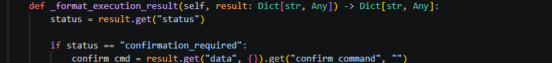
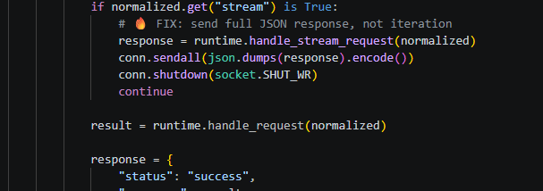
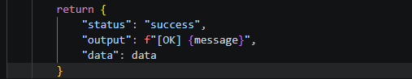
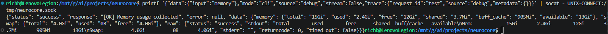
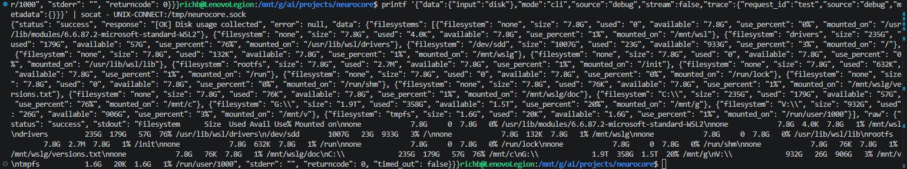
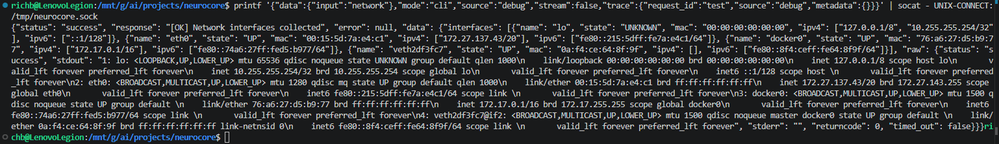
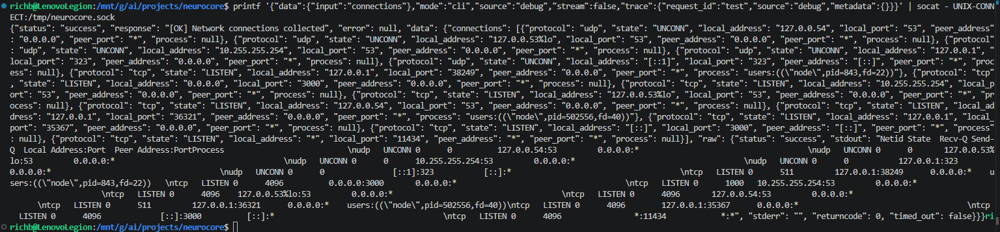
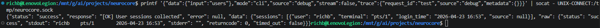
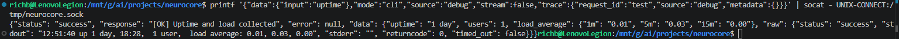

# Build Log 023 – System Tool Structuring and Normalization

---

## Overview

This phase focused on converting system tools from raw-output utilities into **structured telemetry providers**.

In the previous phase, we enforced the requirement that all tools must return a `data` field. That ensured consistency at the contract level, but it did not guarantee that the data itself was usable.

So the goal here was:

> Make system data structured, consistent, and reliable enough for downstream interpretation (Argus)

---

## The Problem

System tools were technically compliant with the contract, but still returned mostly raw output.

That created a limitation:

- data existed, but was not structured  
- every downstream consumer would still need to parse text  
- deterministic diagnostics were not possible  

In short:

> The system had data, but it wasn’t usable yet

---

## Discovery – Deeper Architectural Issue

While implementing structured parsing, a more serious issue surfaced.

Even when tools returned structured data, it was not making it through the system.

---

### Runtime Context

---

### Data Loss in Runtime

---

## What This Meant

The issue wasn’t in the tools.

It was in the execution path.

- tools produced structured data  
- runtime layer discarded it  
- CLI never received it  

This effectively broke the structured contract at the system level.

---

## Secondary Issue – Execution Path Failure

While testing direct requests, another failure surfaced:

---

### Root Cause

- daemon had two execution paths  
- one referenced a method that no longer existed  
- requests using that path failed immediately  

---

## Root Problems Identified

1. Structured data was being dropped by the runtime  
2. Execution path inconsistency in the daemon  
3. System tools were still relying on raw output  

---

## Implementation

### 1. Runtime Manager Fix

The runtime was updated to:

- preserve the `data` field in all responses  
- maintain separation between:
  - `message` (human-readable)
  - `data` (machine-readable)

---

### 2. Daemon Execution Fix

The daemon was simplified:

- removed dual execution paths  
- unified all requests through a single method  

~~~python
handle_stream_request()
~~~

---

### Result

---

## System Tool Normalization

With the execution layer fixed, system tools were updated to follow a consistent pattern:

- collect raw system output  
- extract structured fields  
- preserve full raw output  
- return both in a consistent schema  

---

## Validation

### Baseline (Before Structuring)

---

---

### Full Pipeline (After Fix)

---

## Pattern Applied Across Tools

Once validated, the same approach was applied across the system tool layer.

---

### Disk Usage

---

### Network Interfaces

---

### Network Connections

---

### User Sessions

---

### Uptime and Load

---

## Final Data Contract

All system tools now follow the same structure:

~~~json
{
  "status": "success",
  "message": "...",
  "data": {
    "<structured_fields>",
    "raw": {
      "stdout": "...",
      "stderr": "...",
      "returncode": ...
    }
  }
}
~~~

---

## Key Takeaways

### 1. Data Must Survive the Entire Pipeline

It’s not enough to generate structured data.

It must make it through:

- tool → runtime → daemon → output  

This phase fixed that end-to-end.

---

### 2. Execution Path Simplicity Matters

Multiple execution paths introduced inconsistency and failure.

Unifying the path eliminated that class of bugs.

---

### 3. Structured Data Enables Everything Else

With this layer in place, the system can now support:

- deterministic diagnostics  
- memory and recurrence detection  
- model-based reasoning (without parsing text)  
- tool composition  

---

## Observations (Deferred Improvements)

These are noted but intentionally not addressed in this phase.

---

### CLI Output Formatting

- output does not end with newline  
- causes prompt to appear on same line  

This will be handled later in the CLI layer.

---

### Uptime Parsing

Current:

~~~json
"uptime": "1 day"
~~~

Actual:

~~~text
1 day, 18:28
~~~

Parsing can be expanded later for full detail.

---

### Disk Usage Output Variations

- `"0"` vs `"0B"` depending on system output  

This is acceptable for now.

---

### Network Connections Process Field

Currently stored as raw string:

~~~text
users:(("node",pid=843,fd=22))
~~~

Can be normalized later if needed.

---

### Interface-Specific Addresses

Examples:

~~~text
127.0.0.53%lo
~~~

This is valid Linux behavior and does not require changes.

---

## System State After This Phase

NeuroCore now has:

- structured system telemetry  
- consistent data contracts across all tools  
- reliable data propagation across runtime layers  
- a stable execution path  

---

## Next Phase

With structured data fully in place, the system is ready for:

> Argus tool development (interpretation layer)

This includes:

- system_summary  
- CPU / memory / disk diagnostics  
- multi-signal analysis  

---

## Final Note

This phase started as a straightforward normalization effort, but exposed a deeper issue in how data moved through the system.

Fixing that here keeps everything that follows clean.

At this point, the system isn’t just returning data — it’s returning data that can actually be used.