# Build Log 024 – Argus Tool Layer Foundation and Expansion

---

## Overview

This phase is where things started to feel real.

In the previous phase (023), the system finally had structured data.  
Not raw CLI output. Not strings. Actual usable data.

That was necessary, but it wasn’t enough.

This phase answers the obvious next question:

> Now that I have clean data… what do I actually do with it?

---

## The Goal

Build the first version of the **Argus diagnostic layer**.

Something that doesn’t just return system data, but actually **interprets it**.

---

## Where We Started

At the beginning of this phase:

- system tools were structured  
- runtime preserved data correctly  
- control plane routing was working  

But the system still behaved like this:

> “Here’s your data. Good luck.”

There was no:

- severity  
- diagnosis  
- interpretation  
- guidance  

---

## The Problem

The system could *tell you everything*, but couldn’t *tell you anything useful*.

Examples:

- Memory: shows usage… but is that bad?  
- Disk: shows percentage… but is it critical?  
- Network: shows interfaces… but are they healthy?  

So even though everything was technically working, it still felt like:

> A smarter `top`, not an intelligent system

---

## Step 1 – Build the First Argus Tool

Everything started with:

- `system_summary`

This wasn’t about being comprehensive.  
It was about proving the pattern.

---

### Before

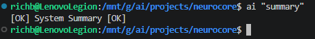

---

### Raw System Data

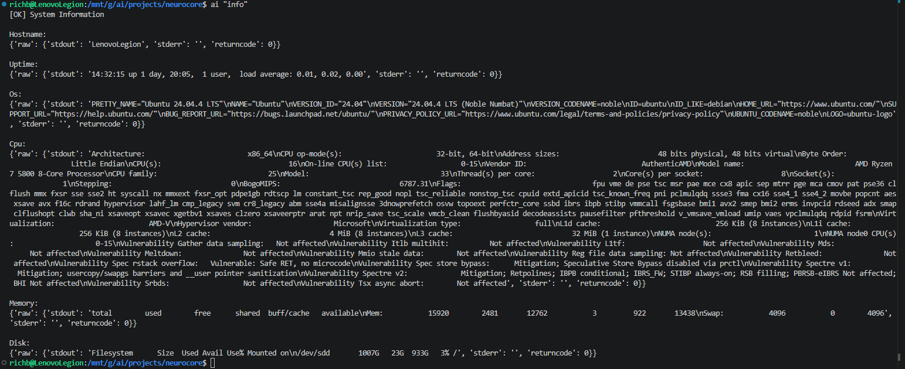

---

### First Pass

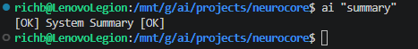

---

### Argus Layer Active

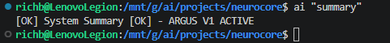

---

### Final Output Shape

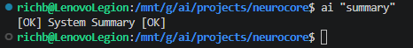

---

## What Changed

Instead of returning raw system info, the tool now:

- pulls structured data  
- applies rules  
- produces:
  - severity
  - findings
  - recommendations  

That’s the moment the system stopped being a data provider and started becoming a **diagnostic system**.

---

## The Pattern (This Is the Important Part)

Once `system_summary` worked, the pattern became obvious:

```
system tool → structured data → interpretation → normalized output
```

That’s it.

No magic. Just consistency.

---

## Step 2 – Validate the Pattern

Before scaling, I made sure:

- control plane routing worked reliably  
- tools registered correctly  
- execution engine passed full context  
- output shape stayed consistent  

Once that held steady, the rest of the phase moved fast.

---

## Step 3 – Apply the Pattern Across the System

After that, this stopped being “figure it out” and became:

> Apply the pattern. Over and over.

No new architecture per tool.  
No special cases unless the data required it.

Just:

- call system tool  
- interpret data  
- return Argus format  

---

## Tool Expansion

---

### Process Analysis

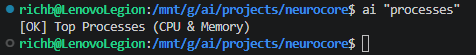

---

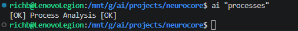

---

---

### Memory Analysis

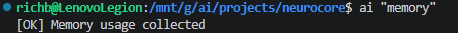

---

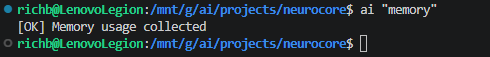

---


---

---

### Disk Analysis

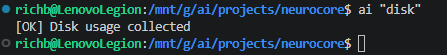

---


---

---

### Network Analysis

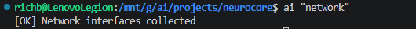

---

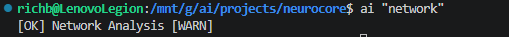

---

---

### Connections Analysis

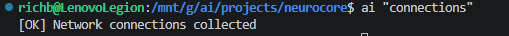

---


---

---

### Uptime Analysis

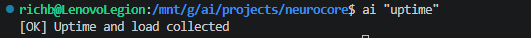

---

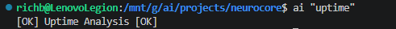

---

---

### Logs Analysis


---

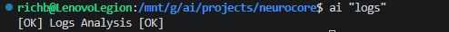

---

## What Was Learned Along the Way

---

### The Pattern Held

Once the first tool worked, everything else followed quickly.

You can feel the shift:

- early phase → careful validation  
- later phase → confident execution  

---

### Not All Data Looks the Same

Some tools needed adjustments:

- memory → already clean  
- disk → multiple filesystems  
- network → loopback behavior  

The pattern stayed the same, but the interpretation had to adapt.

---

### Control Plane Matters More Than It Looks

Every mistake was predictable:

- forgot to register → tool not found  
- forgot to map → pass-through  

That’s actually a good sign:

> The system fails in controlled, understandable ways

---

### Validation Got Faster

Early tools:

- test system tool  
- inspect data  
- adjust logic  

Later tools:

- trust the pattern  
- plug it in  
- verify output  

That’s exactly where you want to be.

---

## What This Actually Enables

This is where it stops being abstract.

Before this phase, if you ran something like:

```
ai "network"
```

You’d get:

- interface names  
- IP addresses  
- raw state  

Now you get something like:

> Network Analysis [WARN]  
> 1 interface not up  
> Recommendation: Investigate network interface state

---

### Real Example

You can now ask:

```
ai "disk"
```

And instead of reading a table, you get:

> Disk Analysis [WARN]  
> High disk usage on /mnt/c (77%)  
> Recommendation: Investigate disk usage and free up space

---

### Another Example

```
ai "processes"
```

Returns:

> Process Analysis [OK]  
> No abnormal CPU or memory usage detected

---

### What That Means in Practice

You’re no longer:

- reading output  
- interpreting it manually  
- guessing what matters  

The system is doing that step for you.

---

### The Bigger Shift

This is the difference between:

- a tool that *shows data*  
- a system that *understands state*  

That's important.

---

## Final Output Contract

Every Argus tool now returns:

~~~json
{
  "status": "success",
  "tool": "<name>",
  "message": "Human-readable summary",
  "data": {
    "severity": "OK | INFO | WARN | CRITICAL",
    "findings": [...],
    "recommendations": [...]
  }
}
~~~

---

## System State After This Phase

At this point, NeuroCore has:

- structured system telemetry  
- a working interpretation layer  
- consistent diagnostic outputs  
- control-plane-enforced execution  
- a reusable diagnostic pattern  

---

## What Comes Next

Now that this exists, a lot of things become possible:

- Argus ACLI (real user-facing tool)  
- incident memory (this happened before → here’s what fixed it)  
- multi-signal diagnostics (disk + memory + logs together)  
- guided troubleshooting  

But none of that works without this layer.

---

## Final Note

This phase wasn’t about complexity.

It was about getting the pattern right.

Once that happened, everything else followed naturally.

At this point:

> The system doesn’t just return system data — it understands what it’s looking at