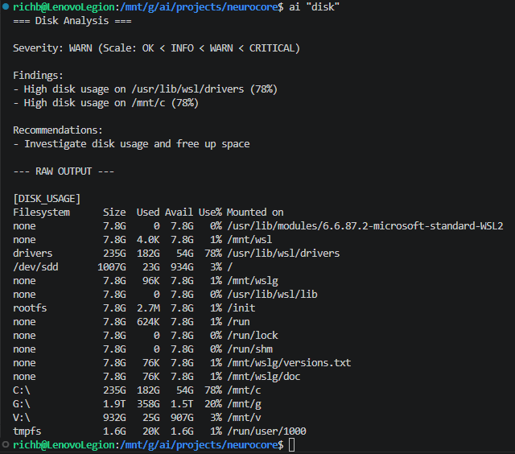
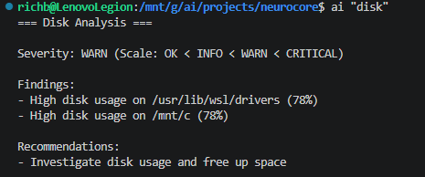
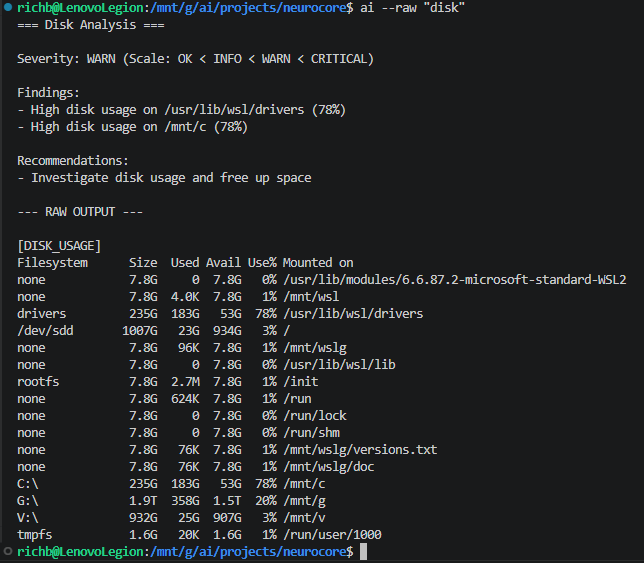
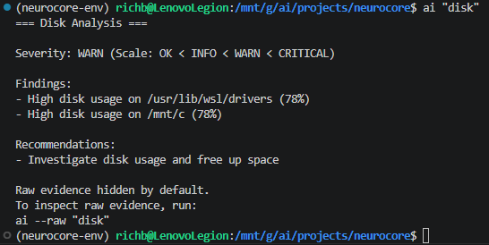
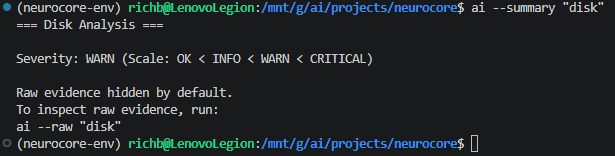
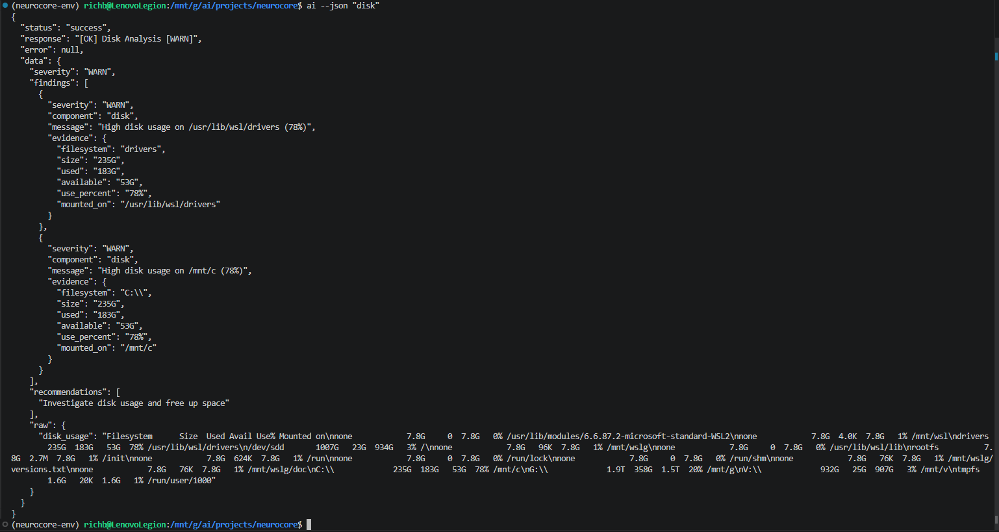
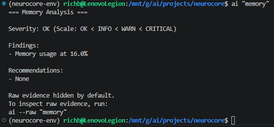
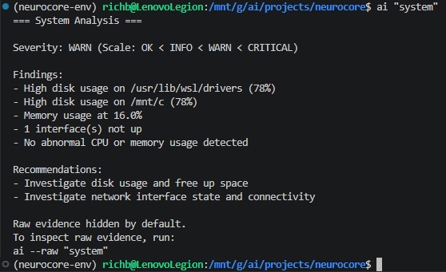

# Build Log 026 – Phase 6 Argus ACLI Output Control

---

## Phase

Phase 6 – Distribution Layer / Argus ACLI Output Control

---

## Objective

This build starts Phase 6 by improving how Argus diagnostic output feels at the command line.

At this point, the diagnostic layer already works. Argus can inspect real system data, interpret it, preserve raw evidence, and return structured findings. The problem now is not whether the data exists.

The problem is presentation.

Raw evidence is valuable, but dumping all of it every time makes the tool harder to scan during normal use. Phase 6 starts turning Argus from “technically correct diagnostic output” into something that feels more like a real user-facing tool.

This pass focused on:

- concise default diagnostic output
- optional raw evidence display
- summary-only mode
- JSON output mode
- copy/paste raw evidence discoverability
- preserving the existing control-plane execution path

The goal was simple:

Make the output easier to use without weakening the architecture.

---

## Files Created

```text
build-logs/026_phase_6_argus_acli_output_control.md
docs/design/phase_6_argus_acli_output_control.md
docs/screenshots/phase-6-output-control/
```

---

## Files Modified

```text
scripts/ai_cli.py
```

---

## Architectural Boundary

This work stayed intentionally inside the CLI / presentation layer.

No changes were made to:

- system tools
- Argus diagnostic tools
- execution engine
- runtime manager
- daemon
- control plane routing
- tool output contracts
- diagnostic interpretation logic

That boundary matters.

The CLI is not supposed to decide what is wrong with the system. It is only supposed to present the structured diagnostic result in a way that is useful to the user.

The request still flows through the established NeuroCore execution path:

```text
CLI
→ Daemon
→ Runtime Manager
→ Control Plane
→ Execution Engine
→ Argus Tool
→ System Tool
→ CommandRunner
→ OS
```

This preserves the core NeuroCore invariant:

```text
daemon → runtime_manager → control_plane → system
```

Argus still diagnoses.

The control plane still governs.

The CLI just makes the result easier to read.

---

## Starting Behavior

Before this Phase 6 pass, Argus diagnostic output already worked correctly.

The existing `disk` command returned:

- title
- severity
- findings
- recommendations
- raw disk evidence

Example command:

```bash
ai "disk"
```

That was correct from a contract perspective. The raw evidence was preserved and visible, which was one of the major goals of the Phase 5J closeout.

But for day-to-day use, the output was noisy. A user running a quick check should not be forced to read the full raw command output every single time.

The screenshot below shows the starting point: useful, accurate, but too verbose by default.



---

## Initial Output-Control Change

The first Phase 6 output-control change was to hide raw evidence by default.

After the change:

```bash
ai "disk"
```

displayed:

- title
- severity
- findings
- recommendations

Raw evidence was no longer printed automatically.

This made the default diagnostic view much easier to scan while keeping the interpreted result intact.



---

## Raw Evidence Mode

Raw evidence still needs to be available. It is one of the things that makes Argus trustworthy.

So a `--raw` flag was added.

Command:

```bash
ai --raw "disk"
```

This restores the full diagnostic view with raw evidence included.

That confirms the important part:

Raw evidence was not removed, destroyed, or dropped from the pipeline. It is only hidden by default at the presentation layer.



---

## Raw Evidence Discoverability

After validating concise default output and raw mode, the next usability issue was obvious:

Users should not have to memorize flags.

The CLI now prints a copy/paste-ready hint when raw evidence exists.

Example:

```text
Raw evidence hidden by default.
To inspect raw evidence, run:
ai --raw "disk"
```

Command:

```bash
ai "disk"
```

Result:



This is a small change, but it matters.

The user gets the clean output first, but the raw evidence is still one copy/paste away. No guessing. No digging through documentation. No “what was that flag again?”

That feels much closer to the direction Argus needs to go.

---

## Summary Mode

A `--summary` flag was validated for quick health checks.

Command:

```bash
ai --summary "disk"
```

Summary mode displays:

- title
- severity
- raw evidence hint when raw evidence exists

It intentionally omits:

- findings
- recommendations
- raw evidence

This gives the user a fast “what is the health state?” view without forcing them to scan the full diagnostic output.



---

## JSON Mode

A `--json` flag was validated to preserve machine-readable workflows.

Command:

```bash
ai --json "disk"
```

This prints the full structured response returned by NeuroCore.

The JSON response still includes:

- status
- response
- error
- data
- severity
- findings
- recommendations
- raw evidence

This confirms the CLI presentation layer does not destroy or alter the underlying structured data.

That is important because the human-facing CLI can become cleaner without sacrificing future automation, testing, scripting, or model-facing workflows.



---

## Cross-Command Validation

The formatter was tested against more than one Argus command to make sure this was not accidentally disk-specific.

---

### Memory Analysis

Command:

```bash
ai "memory"
```

Result:

- concise output
- severity displayed
- findings displayed
- recommendations displayed
- raw evidence hint displayed



---

### System Analysis

Command:

```bash
ai "system"
```

Result:

- multi-signal system analysis remained compatible
- default output stayed concise
- raw evidence was not displayed by default
- raw evidence hint was displayed

This was an important validation because `system` is a multi-signal aggregation command. If the formatter works there, the pattern is stronger than just a one-off disk command improvement.



---

## Validation Commands

The following commands were run and validated:

```bash
ai "disk"
ai --raw "disk"
ai --summary "disk"
ai --json "disk"
ai "memory"
ai "system"
```

Syntax validation was also performed:

```bash
python -m py_compile scripts/ai_cli.py
```

Result:

```text
No output
```

No syntax errors were detected.

---

## Implemented CLI Output Modes

### Default Mode

```bash
ai "disk"
```

Behavior:

- concise diagnostic output
- raw evidence hidden
- raw evidence hint shown when raw data exists

This is now the normal user-facing mode.

---

### Raw Mode

```bash
ai --raw "disk"
```

Behavior:

- diagnostic output
- raw evidence displayed
- no extra raw hint shown

This is the evidence-inspection mode.

---

### Summary Mode

```bash
ai --summary "disk"
```

Behavior:

- title
- severity
- raw evidence hint if raw data exists

This is the quick health-check mode.

---

### JSON Mode

```bash
ai --json "disk"
```

Behavior:

- full structured JSON response printed
- useful for machine-readable workflows
- verifies structured data remains intact

This is the machine-readable mode.

---

## Important Design Decision

Interactive raw evidence prompts were discussed but intentionally not implemented in this pass.

Example deferred behavior:

```text
Would you like to inspect raw evidence? y/n
```

That could be useful later, but it is not the right first move.

Interactive prompts can complicate:

- piping
- automation
- screenshots
- JSON output
- predictable CLI behavior

Instead, the CLI now prints a copy/paste-ready raw evidence command.

That gives the user a friendly path forward without making the CLI unpredictable.

---

## Deferred Ideas

A few good usability ideas came up during this work, but they were intentionally deferred so Phase 6 does not creep into later phases.

Deferred items:

- deterministic friendly command aliases
- broader natural-language command routing
- model/router intent reasoning over fuzzy user phrasing
- interactive raw evidence prompts

These were not implemented because this pass was limited to output control and presentation behavior.

Routing improvements belong in the control plane or a later intelligence phase, not in the CLI formatter.

The CLI should not become a hidden router.

---

## Result

This build completed the first Phase 6 output-control pass.

Argus CLI output now supports:

```text
concise default output
optional raw evidence display
summary-only display
machine-readable JSON output
copy/paste raw evidence discovery
```

This makes Argus easier to use without weakening the architecture established in earlier phases.

The CLI remains a presentation layer.

Argus tools remain responsible for diagnostics.

The control plane remains the authority layer.

Raw evidence remains preserved and available on demand.

This is a solid first step toward making Argus feel less like raw diagnostic plumbing and more like a real command-line product.

---

## Current Repo State After This Pass

Expected working tree state after this implementation:

```text
 M scripts/ai_cli.py
?? build-logs/026_phase_6_argus_acli_output_control.md
?? docs/design/phase_6_argus_acli_output_control.md
?? docs/screenshots/phase-6-output-control/
```

---

## Remaining Phase 6 Plan

This build completed the first output-control pass, but Phase 6 has a larger defined plan.

The active lane remains the Argus ACLI user experience layer. That includes continuing to improve how Argus presents diagnostic output without moving diagnostic logic into the CLI or bypassing the control plane.

Remaining output-control work includes:

- selected-signal output controls
- severity/filtering modes
- improved multi-signal formatting
- production vs training output profiles
- eventual move or mirror of this behavior into `distributions/argus/cli/acli.py`

Phase 6 also includes separate distribution-layer workstreams that should only be started intentionally:

- initial runtime packaging
- filesystem layout planning
- incident memory, only if explicitly selected and kept from interrupting the primary output-control work

The following ideas remain deferred beyond the current output-control lane:

- broad natural-language command routing
- model/router fuzzy intent reasoning

Those ideas are valid, but they belong in the control plane or later intelligence layers, not in the CLI formatter.