# Build Log 027 – Phase 6 Argus ACLI Output-Control Completion

---

## Phase

Phase 6 – Distribution Layer / Argus ACLI Output Control

---

## Status

Done.

This is the continuation of Phase 6 after the first output-control pass.

---

## What This Was Actually About

This wasn’t about making the system smarter.

It already knows what it’s doing.

This was about making it not feel like garbage to use.

Main goals:

- clean up the output so you can actually read it
- make it faster to scan
- let the user control what they see
- keep raw evidence available without dumping it everywhere
- start figuring out what ACLI is supposed to feel like

Everything stayed in the CLI.

No touching tools.  
No touching logic.  
No touching the control plane.  

---

## Files Touched

scripts/ai_cli.py

---

## Screenshots

All screenshots for this build are in:

docs/screenshots/phase-6-acli-completion/

---

## Before We Started

Grabbed baseline shots so we don’t lie to ourselves later.

### Default Output (Before)

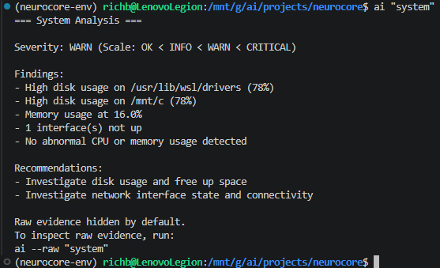

### Raw Mode

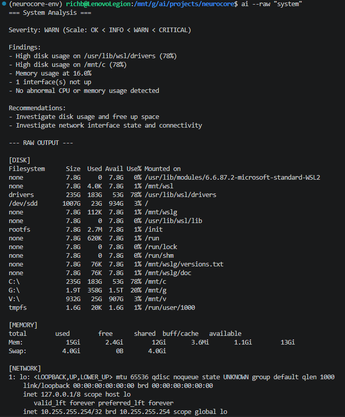

### Summary Mode

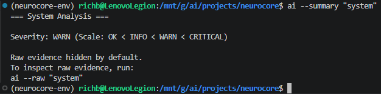

### JSON Mode

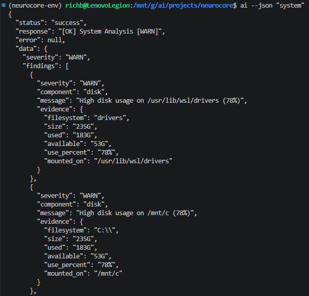

Everything worked.

But it didn’t feel good.

---

## 1. Fixing the Output (Finally)

First thing — make it readable.

We already had the data. It just looked like a mess.

Started by adding structure to findings:

[disk] [WARN] High disk usage on /mnt/c (78%)

Looked better… but still ugly.

### First Attempt (Too Busy)

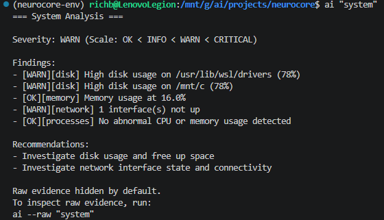

Then cleaned it up:

- sorted by severity
- added spacing
- indented properly
- stopped cramming everything together

### After Cleanup

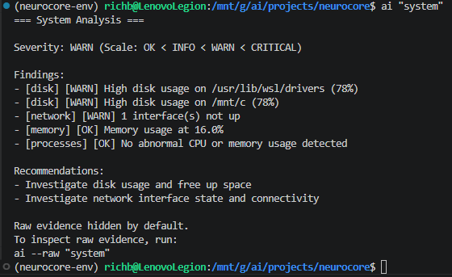

### Final Output

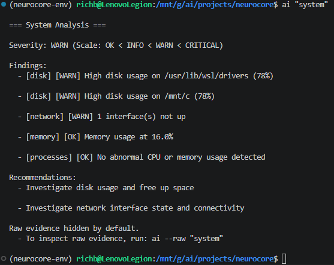

Also checked it against simpler outputs:

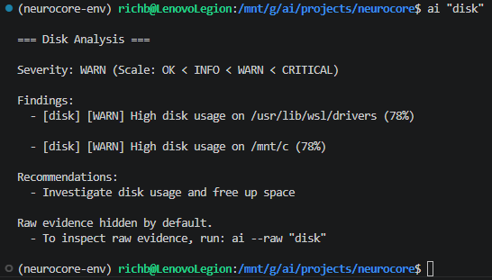

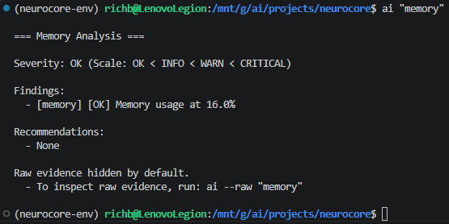

This is where it started to feel like a real tool.

---

## 2. Severity Filtering

Added:

ai --severity WARN "system"

This lets you cut the noise.

Important part:

This does NOT change anything under the hood.  
It just changes what you see.

### Example

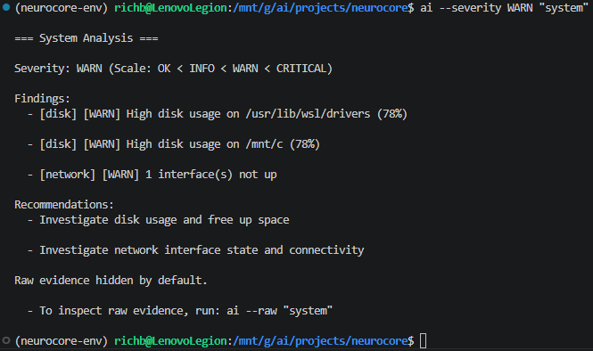

### Empty Case (Handled Clean)

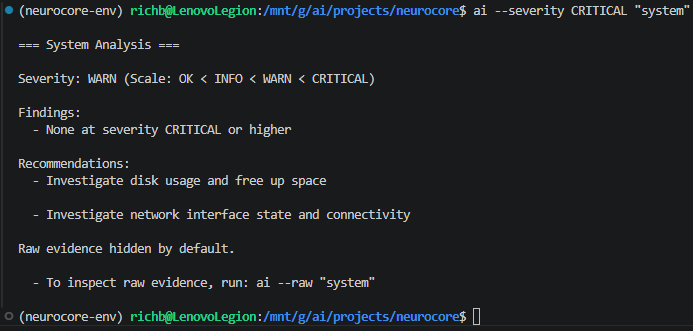

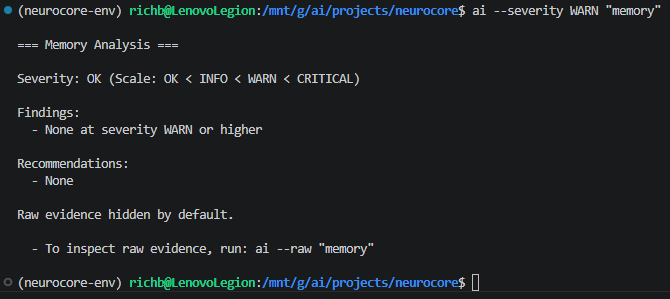

No weird behavior. No crashes. Just clean.

---

## 3. Signal Filtering

Added:

ai --signal disk "system"

Now you can zoom into one part of the system.

### Disk Only

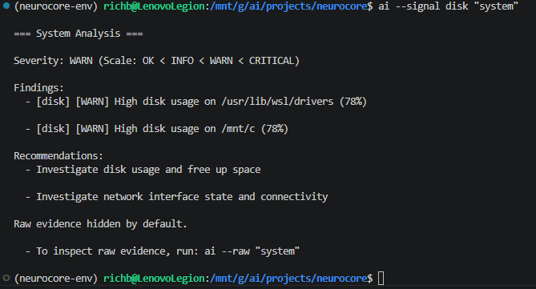

### Unknown Signal

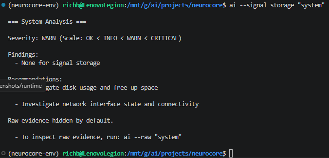

### Combined Filters

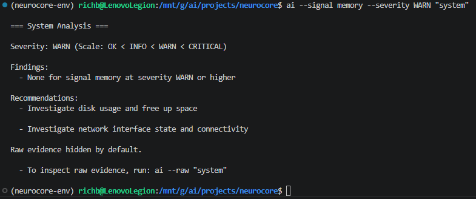

Signal + severity works exactly like you’d expect.

---

## 4. Recommendation Label Fix

This one matters more than it looks.

Problem:

When you filter findings, recommendations still show (correct)…  
but it looked like they were filtered too (wrong).

Fix:

Filtered views now say:

Recommendations from full diagnostic:

Instead of:

Recommendations:

### Example

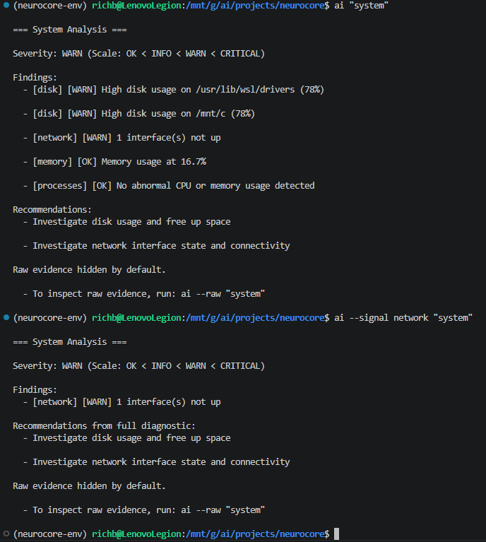

Now it’s honest.

---

## 5. This Is Where ACLI Became Clear

This is the biggest takeaway from this build.

ACLI is NOT supposed to be:

- just commands
- or just AI chat

It has to be both.

---

### Natural Mode (This is the goal)

acli "what's wrong with my system?"  
acli "why is disk warning?"  
acli "show me only network issues"  
acli "what should I check next?"

This is what makes Argus different.

---

### Direct Mode (Fast + Practical)

acli system  
acli disk  
acli memory  
acli network  
acli logs  

This is what admins will actually use all day.

---

### Power Mode (Full Control)

acli system --signal disk  
acli system --severity WARN  
acli system --signal disk --severity WARN  
acli --raw system  
acli --json system  

This is where it becomes a real tool.

---

### The Balance

ACLI should feel easy first.

But it should also be insanely powerful when you need it.

That balance is the whole game.

---

### Important Rule

Do NOT shove natural language logic into the CLI.

That belongs here:

router → reasoning → control plane

CLI stays clean.

---

## 6. acli Is Now Real

Added:

/usr/local/bin/acli -> scripts/ai_cli.py

And made the CLI aware of how it was called.

### Example

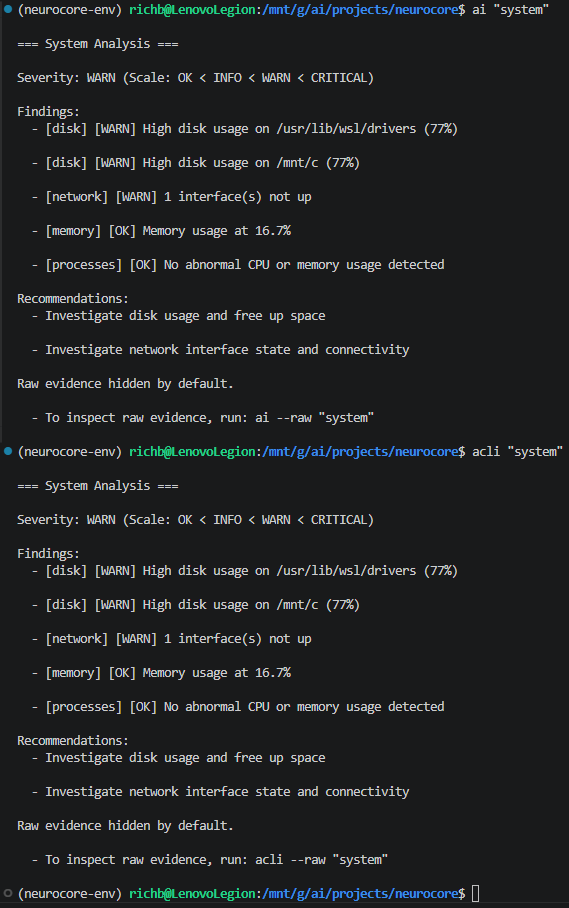

- ai → shows ai --raw
- acli → shows acli --raw

Small thing, but important.

---

## 7. Command Feel (Already There)

Turns out this already worked:

acli system  
acli system --signal disk  
acli system --severity WARN  

No quotes needed.

Feels natural.

---

## 8. Sanity Check (Direct Commands)

Ran:

acli disk  
acli memory  
acli network  
acli logs  

All clean.

---

## What We Did NOT Touch

Everything important stayed exactly where it belongs:

- system tools
- Argus tools
- control plane
- execution engine
- data contract

Flow is still:

CLI → daemon → runtime → control plane → execution → tools → OS

No shortcuts.

---

## Final Result

This is where Phase 6 finally clicked.

Now:

- output is clean
- filters actually help
- raw data is still there when you need it
- acli is a real command
- and the UX direction is finally clear

This doesn’t feel like a prototype anymore.

---

## What This Unlocks

Now we can move forward without guessing:

- real natural-language routing (done the right way)
- better multi-signal views
- actual ACLI distribution layer

Direction is locked in.